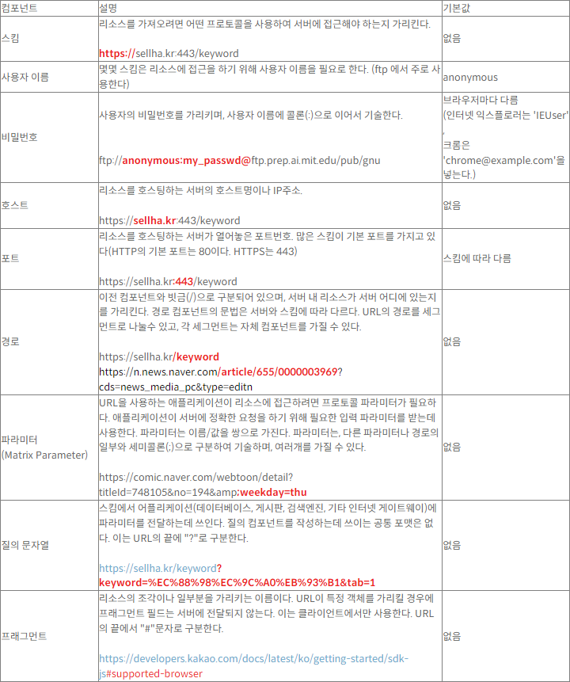

# HTTP

## 2장 URL과 리소스

### 리소스

웹 리소스란 웹에 콘텐츠를 제공하는 모든 것 / html, word, jpeg 등 모든 종류의 파일을 포함한다.
이 때 리소스는 동적 파일일 수 있다. (요청에 따라 다른 콘텐츠를 제공)

### 미디어타입

HTTP는 웹에서 전송되는 객체에 MIME(Multipurpose Internet Mail Extensions) 이라는 데이터 포맷 타입을 붙인다.

> 원래 이 MIME이라는 타입이 메일 시스템에서 메시지가 오갈 때 겪는 문제점을 해결하기 위해 사용했는데, 워낙 잘 작동되어 HTTP에서도 사용

- 웹 브라우저는 서버로부터 객체를 돌려받을 때, 다룰 수 있는 객체인지 MIME 타입을 통해 확인한다.
- 대부분의 웹 브라우저는 객체 타입 수백 가지를 다룰 수 있다.

### URL (Uniform Resource Locator)

- 인터넷의 리소스를 가리키는 표준 이름이다.
- URL은 전자정보 일부를 가리키고 그것이 어디에 있고 어떻게 접근할 수 있는지 알려준다.
- URL은 통합 자원 식별자(Uniform Resource Identifier) 혹은 URI라고 불리는 더 일반화 된 부류의 부분집합이다.

> ☆ URI : 통합 자원 식별자로 인터넷의 우편물 주소 같은 것으로, 정보 리소스를 고유하게 식별하고 위치를 지정할 수 있다. URL과 URN으로 구성된 종합적인 개념이다.
>
> 1. URL : 리소스가 어디에 있는지로 리소스를 식별한다.
> 2. URN : 현재 그 리소스가 어디에 존재하든 상관없이 그 이름만으로 리소스를 식별한다.

### URL 문법

- 대부분의 URL의 문법은 일반적으로 9개 부분(컴포넌트)으로 나뉜다.

> <스킴>://<사용자이름>:<비밀번호>@<호스트>:<포트>/<경로>;<파라미터>?<질의>#<프래그먼트>

