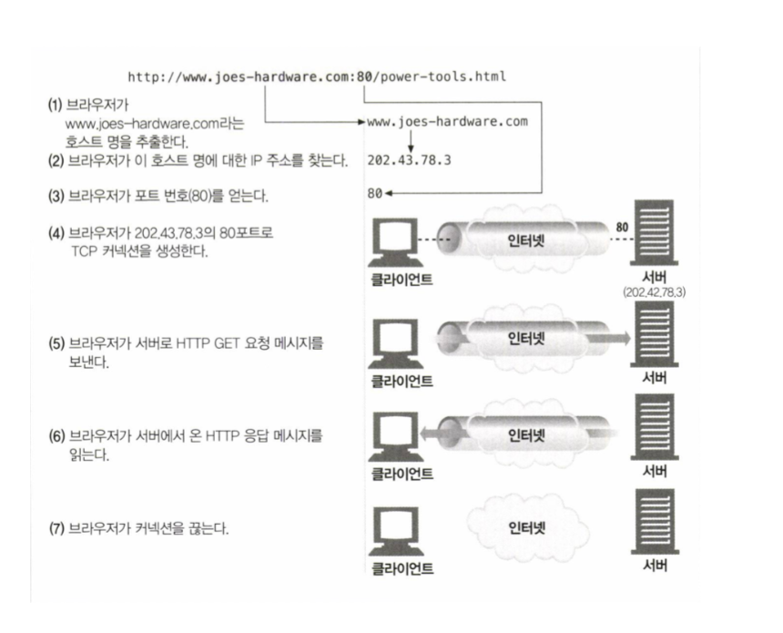

# HTTP

## 4장 TCP 커넥션 관리

### TCP 커넥션

- 현재 전 세계 대부분의 HTTP 통신은 TCP/IP 프로토콜을 통해 이루어지고 있다.

### 웹 브라우저가 TCP 커넥션을 통해서 웹 서버로 보내는 순서

- 브라우저가 호스트명을 추출합니다.
- 브라우저가 이 호스트 명에 대한 IP 주소를 찾습니다.
- 브라우저가 포트 번호를 얻습니다.
- 브라우저가 IP주소의 포트로 TCP 커넥션을 생성합니다.
- 브라우저가 서버로 HTTP 메소드를 보냅니다.
- 브라우저가 서버에서 온 HTTP 응답 메시지를 읽습니다.
- 브라우저가 커넥션을 끊습니다.

...
