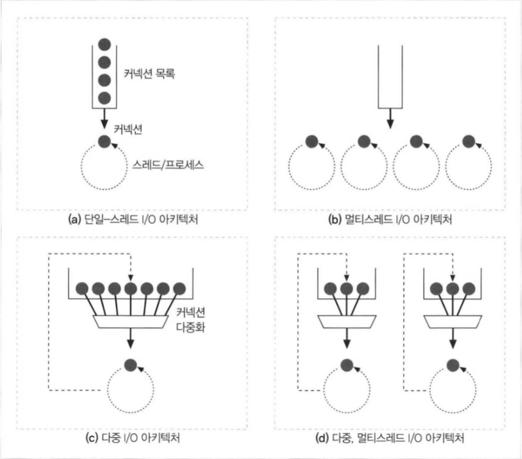

# HTTP

## 5장 웹 서버

### 웹 서버가 하는 일

- 커넥션을 맺는다.
- 응답을 받는다.
- 응답을 처리한다.
- 리소스에 접근한다.
- 응답을 만든다.
- 응답을 보낸다
- 트랜잭션을 로그에 기록한다.

### 응답을 처리하는 과정

- 요청줄을 파싱하여, 메서드, 식별자(URI), 버젼 번호를 찾는다.
- 요청줄을 캐리지 리턴 줄바꿈(CRLF) 문자열로 끝나는 것을 찾는다. (캐리지 리턴 줄바꿈이란 \n와 같은 문자열을 의미)
- 메세지 헤더들을 읽고 각 메세지 헤더는 CRLF로 끝난다.
- 헤더의 끝을 의미하는 CRLF로 끝나는 줄을 찾으면 요청 본문을 Content-Length 만큼 읽는다.

### 서버의 멀티쓰레드 지원 여부

- 단일 쓰레드는 한 번에 하나의 요청만 처리한다.
- 멀티쓰레드는 여러 개의 요청을 한번에 처리 한다.
- 다중 I/O는 모든 커넥션을 동시에 감시해서 커넥션을 조절할 수 있다.
- 다중 멀티쓰레드 I/O는 하나의 쓰레드가 여러개의 커넥션을 조절하는 방식이다.

