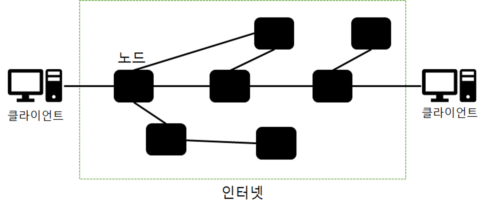
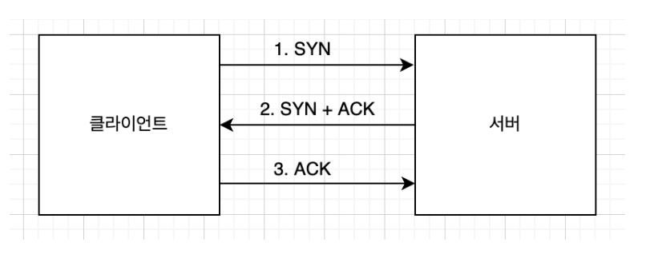

### 인터넷 네트워크

네트워크란 Net + work 쉽게 이야기하면 그물로 이루어진 통신망이다.

현재 나의 위치에서 다른 친구에게 메세지를 전달할 수 있는 방법 이때 사용하는게 네트워크이다.

뿐만 아니라 우리가 현재 보고 있는 이 화면들, 수많은 데이터들 역시 네트워크를 통해 컴퓨터간, 서버간 통신을 하며 데이터를 주고 받기 때문에 가능한 일들이다.

네트워크는 굉장히 복잡하게 연결되어 있다. 메세지를 보낸다고 하면 다이렉트로 가는 것이 아니라 중간에 존재하는 노드(서버)들을 거쳐 도착한다.

데이터를 보낼 때에는 데이터 뿐만 아니라 여러 정보를 담아 패킷을 만들게 되는데 출발지, 도착지 등 많은 정보가 담겨 있다.

도착지를 보고 규칙과 규약을 따르며 도달 가능한 중간 노드로 계속 데이터를 이동시키게 되고 최후에는 목적지에 도착을 한다.

### IP 프로토콜

IP는 인터넷 프로토콜 Internet Protocol의 약자로서 인터넷에 연결된 모든 장치들을 식별할 수 있는 고유의 주소이고, 프로토콜은 이를 이용하는 하나의 규약이다.

IP는 IPv4와 IPv6의 두 가지 종류가 있으며, IPv4를 많이 이용한다. 각 자리는 8비트씩 \* 4 = 총 32비트로 이루어져있다.

> xx.xxx.xx.xxx (123.142.3.22) 와 같이

#### 한계

IP 프로토콜은 위에서 언급한 바와 같이 고유의 주소이기 때문에 이용되지만, 한계점을 가지고 있다.

#### 비연결성

데이터를 받는 쪽이 네트워크에 연결되어 있는지 사전에 확인을 하지 않는다.

받는쪽의 네트워크가 연결되어있는지 여부와 상관 없이 메세지를 보낸다. 네트워크에 연결되어 있지 않기 때문에 받을 수 없다.

#### 비신뢰성

테이터(즉, 패킷)를 전송할 때 패킷의 순서가 보장되지 않고 패킷이 손실되었는지 알 수 없다.

#### 프로그램 구분

한 컴퓨터안에서는 동시에 웹페이지를 보며 노래를 들을수도 있고 게임을 할 수도 있다.

IP만으로는 이것을 구분하기 힘들다.

### TCP 프로토콜

위와 같은 문제를 해결하기 위해 TCP 프로토콜을 이용한다.

TCP 프로토콜은 출발지와 목적지 PORT를 정하고, 전송 제어, 순서, 검증 등을 가능하게 한다.

#### 연결 지향 -TCP 3 way hand shake

네트워크에 연결되어 있다는 것을 확인하려면 상대쪽에서 연결되어있다는 신호를 보내줘야 한다.

SYN과 ACK가 이를 가능하게 해준다.

- SYN : 접속 요청
- ACK : 요청 수락

우선 클라이언트 측에서 연결하고 싶은 서버에 SYN 신호를 보내게 된다. 이때 서버가 연결되어 있다면 SYN + ACK를 보낸다.
이 신호가 클라이언트 측에 도달하지 않는다면, 연결이 되어 있지 않다는 거다. 이 신호를 받게 되면 클라이언트에서 서버 측으로 ACK 신호를 보내게 된다.

#### 데이터 전달 보증

데이터 전달 보증이란 데이터를 전송하고 상대쪽에서 받게 된다면 데이터를 잘 받았다고 신호를 주게 되고, 이것이 데이터 전달을 보증하게 된다.

#### 순서 보증

패킷이 1, 2, 3 순서로 전달 된다면 1, 2, 3 순서로 도착을 해야 한다.
1, 3, 2 순서로 도착한다면 다시 보내야 하기 때문에 이것이 순서를 보증하게 된다.

#### PORT

포트는 같은 장비, 즉 IP 내에서 프로세스를 구분 가능하게 해준다. 동시간에 여러 프로세스가 돌아갈 때, 데이터가 해당하는 프로그램에 올바르게 도달하게 해준다.

#### UDP

UDP는 TCP와 같은 계층이지만, 기능이 거의 없다. 오히려 IP와 비슷하고 PORT만 추가 되어 있다. 하지만, 그렇기에 단순하고 빠르다는 장점이 존재한다. 요즘 떠오르는 HTTP 3.0은 UDP 위에서 돌아가게 만든다고 한다.

### DNS

데이터를 특정 서버에 요청하기 위해서는 IP와 PORT가 필요하다. 그런데 숫자로 이루어진 IP를 기억하기는 사실상 불가능하다. 그렇기에 그 IP를 대신할 수 있는 것이 바로 DNS(Domain Name System)이다.

구글에 접속을 할 때, google.com을 입력하지 구글의 IP를 입력하지 않는다. 여기서 google.com이 도메인명이다.

### URI

URI는 Uniform Resource Identifier의 약자이다.

- Uniform : 리소스를 식별하는 통일된 방식
- Resource : 자원으로서 URI로 식별할 수 있는 모든 것
- Identifier : 항목을 구분하는데 필요한 정보

URI의 큰 범주 안에 URL과 URN이 존재한다.

### HTTP

HTTP는 Hyper Text Transfer Protocol로서 모든 것을 담아 전송할 수 있다.

HTTP/1.1 , HTTP/2.0 , HTTP/3.0의 버전이 존재하고 전자의 두 버전은 TCP기반이지만 후자의 HTTP/3.0은 UDP 기반으로 현재 개발 진행중에 있다.

### 특징

클라이언트, 서버 구분 / request, response의 구조이며 클라이언트측에서 서버로 요청을 전송하고 응답을 대기한다.
반면 서버는 클라이언트 측의 요청에 대한 응답을 만들어 전송을 한다.

#### 무상태 프로토콜(stateless)

서버가 클라이언트의 상태를 보존하지 않는다. 예를 들어 A라는 고객이 운동화 제품을 산다는 상태를 보존하고 있다면 현재 서버가 다운됐을 때, 다른 서버로 요청을 보내도 그 서버는
A 고객이 운동화 제품을 산다는 상태를 모르기 때문에 문제가 발생한다.

- 장점 : 서버 확장성이 높다.(스케일 아웃) -> 요청이 증가하면 서버를 계속 증설할 수 있다.
- 단점 : 클라이엉ㄴ트가 추가 정보를 계속 제공해야 한다.

#### 비연결성

HTTP는 연결을 유지하지 않는다. 그렇기 때문에 서버 자원을 효율적으로 사용할 수 있다. 하지만 TCP/IP연결(3way hand shake)을 새로 해야한다는 문제도 있다.

> 지속 연결로 해결

한번 TCP/IP 연결을 하면 바로 끊는게 아니라 일정 시간 동안 연결을 유지하는 것
